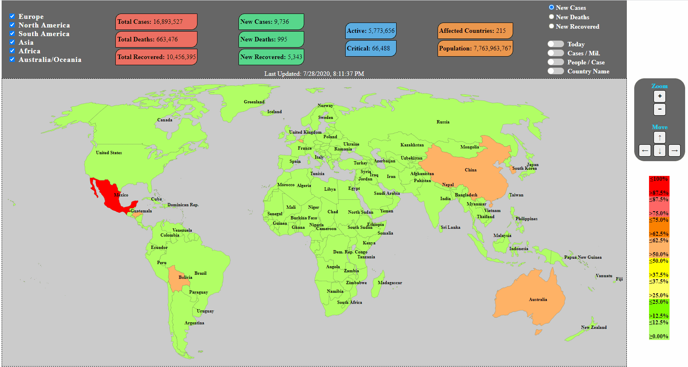

# COVID19 Statistics

## Description

This is an interactive map with worldwide COVID-19 statistics. This map is kept simple and elegant to allow the user to have all the necessary information at their finger tips. Valuable sources are also provided for further analysis.

## Demo

## Usage:

Visit https://simpleglobalstats.com

## Todo

- [x] User control switch implementation
- [x] Graphs at the bottom, given a user clicks on a country (display data over months)
- [x] Table with user click information
- [ ] Percentage gain/loss from previous day in both global and local
- [ ] List of credible sources user can visit for more information/news (websites/youtube channels)

